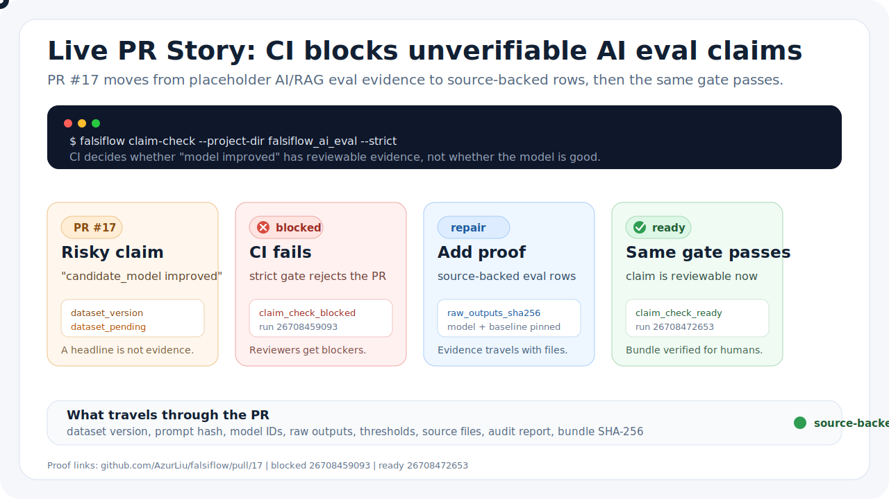
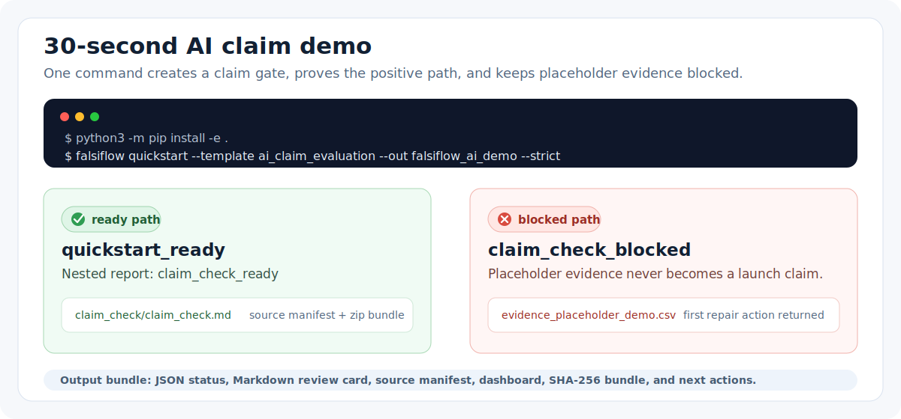
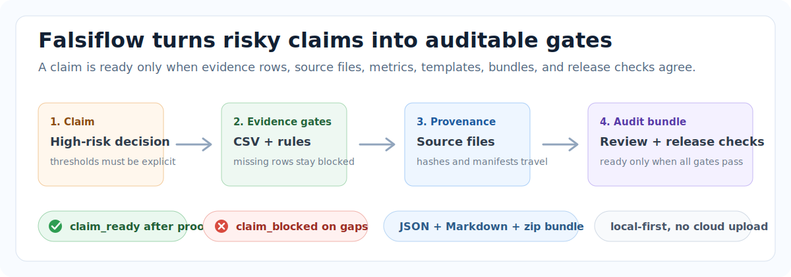
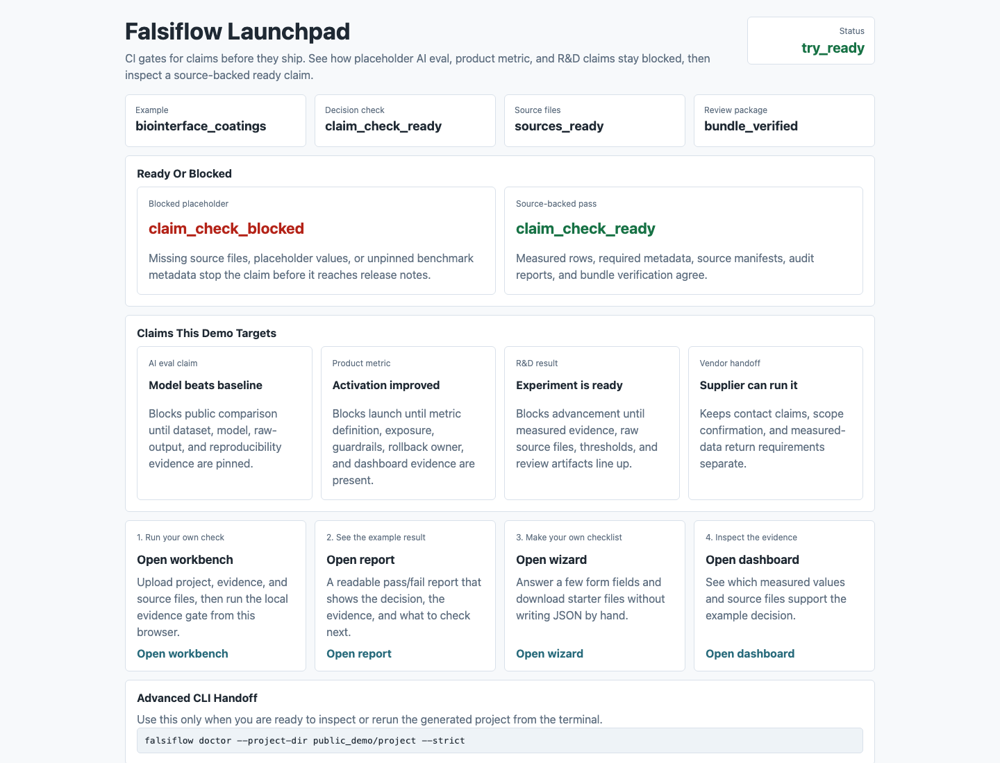
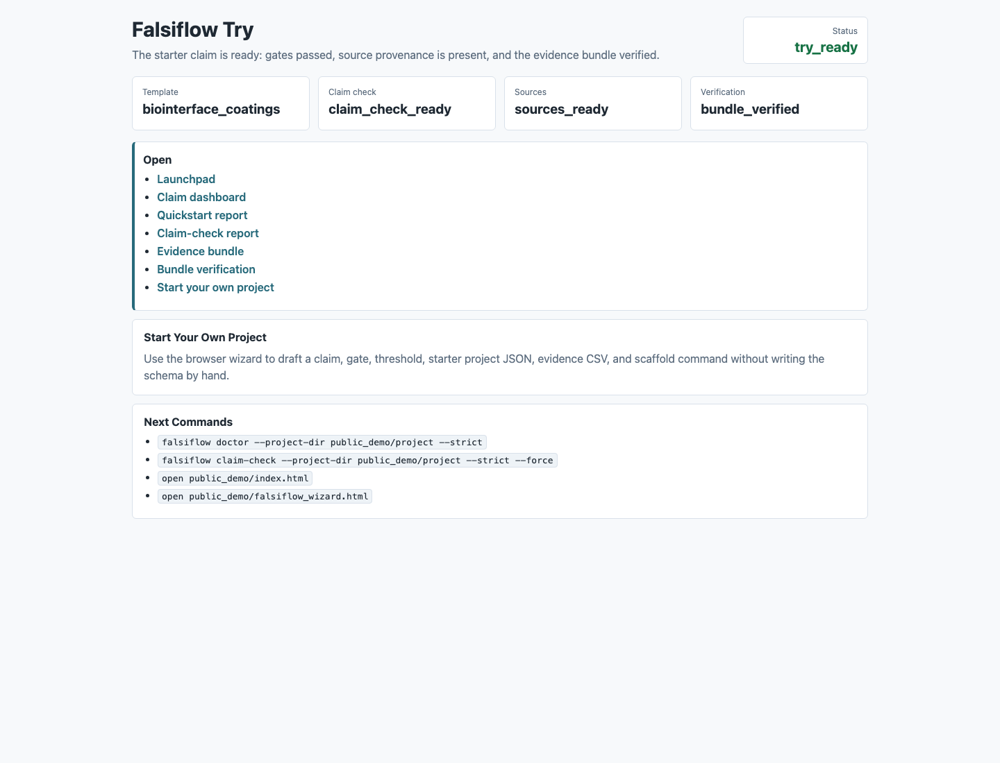
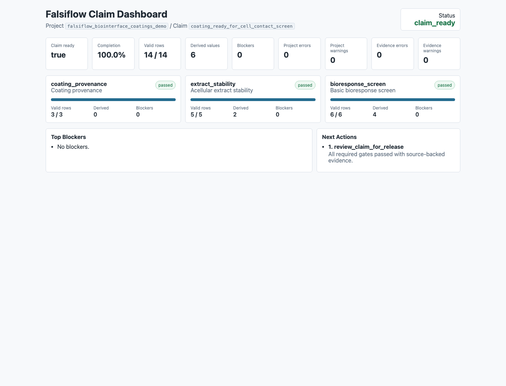
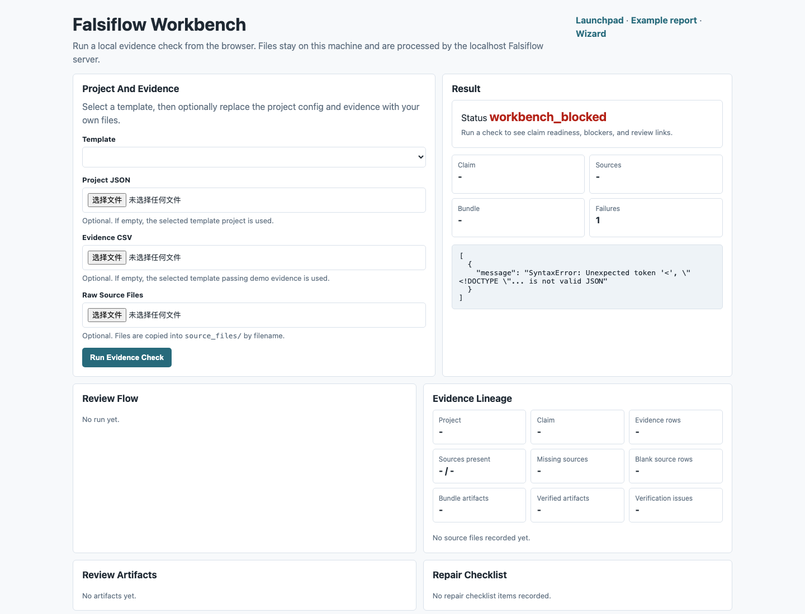

# Falsiflow

Stop unverifiable AI eval, product metric, and R&D claims from passing CI.

Falsiflow blocks "the model improved" until the repo provides pinned eval
provenance, source-backed evidence rows, raw files, thresholds, and a review
bundle.

[](https://github.com/AzurLiu/falsiflow/actions/workflows/falsiflow.yml)
[](https://github.com/AzurLiu/falsiflow/actions/workflows/falsiflow-cross-platform.yml)
[](https://github.com/AzurLiu/falsiflow/actions/workflows/falsiflow-scorecard.yml)

Public demo with the Live PR Story: <https://azurliu.github.io/falsiflow/>. PyPI package:
<https://pypi.org/project/falsiflow/>. PyPI trusted publishing: completed.
External evidence workflow:
<https://github.com/AzurLiu/falsiflow/actions/workflows/falsiflow-external-evidence.yml>.



30-second demo (CLI):



## 30 Seconds

```bash
pipx install falsiflow
falsiflow quickstart --template ai_claim_evaluation --out falsiflow_ai_demo --strict
falsiflow doctor --project-dir falsiflow_ai_demo --strict
```

Expected status:

```text
quickstart        -> quickstart_ready
placeholder evidence  -> claim_check_blocked
source-backed evidence -> claim_check_ready
```

Live PR Story: [PR #17](https://github.com/AzurLiu/falsiflow/pull/17)
shows placeholder AI/RAG eval evidence failing CI in the
[blocked run](https://github.com/AzurLiu/falsiflow/actions/runs/26708459093),
then source-backed evidence passing in the
[ready run](https://github.com/AzurLiu/falsiflow/actions/runs/26708472653).

Drop the same gate into another repository with the GitHub Action:

```yaml
- uses: AzurLiu/falsiflow@main
  with:
    mode: claim-check
    project-dir: falsiflow_ai_eval
    evidence: falsiflow_ai_eval/evidence.csv
    strict: "true"
```

Or run from source while contributing:

```bash
git clone https://github.com/AzurLiu/falsiflow.git
cd falsiflow
python3 -m pip install -e .
falsiflow quickstart --template ai_claim_evaluation --out falsiflow_ai_demo --strict
```

Current public status: hosted demo, PyPI, CI, cross-platform smoke tests,
Scorecard, checkout pipx, public-package pipx, Windows PowerShell smoke, and
source installs are live. `Falsiflow External Evidence` reports
`external_ready` for the current public release.

Evidence gate flow:



## Fast Paths

- New users: run `make install-local && make start`, then open the local
  launchpad, proof report, dashboard, workbench, and wizard.
- CLI users: run `falsiflow quickstart --template biointerface_coatings --out
  my_falsiflow_project --strict`, then `falsiflow doctor --project-dir
  my_falsiflow_project --strict`.
- Template authors: start with `falsiflow template-gallery`, then use
  `template-check`, `template-pack`, `template-release`, and
  `template-install` before sharing a template.
- Launch reviewers: run `falsiflow launch-kit --out-dir falsiflow_launch_kit
  --force` to generate public copy, a demo script, a proof card, and a
  launch metrics tracker before account-bound publishing.
- Maintainers: run `falsiflow adoption-check --out-dir
  data/falsiflow/adoption_check --force` and `falsiflow release-check --out-dir
  data/falsiflow/release_check --force` before publishing.

## Community Entry Points

- Report reproducible command failures with
  `.github/ISSUE_TEMPLATE/bug_report.yml`.
- Propose CLI, template, or documentation improvements with
  `.github/ISSUE_TEMPLATE/feature_request.yml`.
- Request or review evidence-gate template work with
  `.github/ISSUE_TEMPLATE/claim_gate_request.yml`.
- Use [docs/falsiflow_launch_execution.md](docs/falsiflow_launch_execution.md)
  for launch copy, channel-specific posts, awesome-list candidates, and metrics
  review windows.
- Open pull requests with `.github/PULL_REQUEST_TEMPLATE.md`, including the
  verification commands and responsible-use boundary.
- Read [CODE_OF_CONDUCT.md](CODE_OF_CONDUCT.md), [SUPPORT.md](SUPPORT.md),
  [ROADMAP.md](ROADMAP.md), [GOVERNANCE.md](GOVERNANCE.md), and
  [CITATION.cff](CITATION.cff) before starting larger community, citation, or
  adoption work.
- Review [docs/falsiflow_security_posture.md](docs/falsiflow_security_posture.md)
  for the local-first security posture, Dependabot coverage, OpenSSF Scorecard
  workflow, bundle verification, and supply-chain release gates.

## Project Priorities

Falsiflow is being optimized for open-source adoption in this order:

1. Clear first-run experience.
2. Trusted JSON and Markdown audit reports.
3. Templates that prove the workflow is broader than one material domain.
4. Repeatable release and package distribution.
5. Simple commands and actionable failure messages.

The maintained priority record is
[docs/falsiflow_adoption_priorities.md](docs/falsiflow_adoption_priorities.md).
For the 1k-star launch checklist, distribution sequence, stop conditions, and
article drafts, see
[docs/falsiflow_1k_launch_plan.md](docs/falsiflow_1k_launch_plan.md).
For the module map, command flow, release invariants, and extension points, see
[docs/falsiflow_architecture.md](docs/falsiflow_architecture.md).
For evidence CSV fields, JSON status contracts, report artifacts, schemas, and
CI/ELN/LIMS integration boundaries, see
[docs/falsiflow_data_contract.md](docs/falsiflow_data_contract.md).
For vendor, instrument, plate-reader, generic wide-CSV, AI eval, local LLM
eval, and RAG eval adapter profiles, see
[docs/falsiflow_adapter_profiles.md](docs/falsiflow_adapter_profiles.md).
For the local stdio MCP server used by AI coding agents, see
[docs/falsiflow_mcp.md](docs/falsiflow_mcp.md).
For blocked command recovery, install/start problems, template failures,
`claim_check_blocked`, and `external_blocked`, see
[docs/falsiflow_troubleshooting.md](docs/falsiflow_troubleshooting.md).
For template authoring, placeholder demo design, source provenance, and
verified template release flow, see
[docs/falsiflow_template_authoring.md](docs/falsiflow_template_authoring.md).
For a comparison against spreadsheets, CI suites, ELN/LIMS systems, ML eval
harnesses, materials databases, and workflow orchestrators, see
[docs/falsiflow_positioning.md](docs/falsiflow_positioning.md). It also names
the boundary with Great Expectations, Evidently, Deepchecks, MLflow, and plain
GitHub Actions.
For concrete public case cards across Biointerface coatings, neural materials,
AI claim evaluation, RAG quality gates, product metric launches, vendor
handoffs, and wetware support hardware, see
[docs/falsiflow_public_casebook.md](docs/falsiflow_public_casebook.md).
For the bundled RAG quality gate starter template with evaluation-set
provenance, retrieval quality, answer faithfulness, source coverage, local
import coverage, and placeholder-blocked evidence rows, see
[docs/falsiflow_rag_quality_gate_proposal.md](docs/falsiflow_rag_quality_gate_proposal.md).
For machine-verifiable casebook proof across positive demos and placeholder
blockers, run `falsiflow casebook-check` and see
[docs/falsiflow_casebook_check.md](docs/falsiflow_casebook_check.md).
For the generated command reference, see
[docs/falsiflow_cli_reference.md](docs/falsiflow_cli_reference.md) or run
`falsiflow cli-reference --out docs/falsiflow_cli_reference.md`.

## When To Use It

Use Falsiflow when a claim should not move forward until the evidence is
source-backed, repeatable, and reviewable. Good fits include:

- R&D screening gates where missing provenance can waste experiment budget.
- Vendor or external-lab handoffs where replies, quotes, and measured evidence
  must stay distinct.
- Reusable project templates that need version locks, hashes, provenance
  attestations, and adoption policy before another team installs them.
- CI checks that should fail when a workflow quietly regresses from measured
  evidence to placeholders.

## Thirty-Second Try

Install and open the local app first if you only want to see the workflow:

```bash
make install-local
make start
```

`make install-local` installs the current checkout in editable mode.
`make start` runs `falsiflow start`, the beginner entry point. It chooses a
free localhost port, opens the browser automatically, writes
`serve_summary.json`, and keeps all data on the local machine. The page explains
the example decision in plain language, then links to the proof report,
dashboard, review bundle, wizard, and `workbench.html`. The workbench lets a
local browser user select a template, upload `project.json`, evidence CSV, and
raw source files, run the evidence check, then inspect ready/blocked status,
review flow, evidence lineage, repair checklist, source manifest, dashboard,
bundle verification, and evidence bundle links without touching the terminal.
Use `falsiflow start --reset` when you want to regenerate the local demo files.

For a one-command local install from an existing checkout:

```bash
scripts/install_local.sh --from-local . --check
```

For a public GitHub release, publish `scripts/install_local.sh` and set the
repository URL in the install command:

```bash
FALSIFLOW_REPO_URL=https://github.com/YOUR_ORG/falsiflow.git \
  sh -c "$(curl -fsSL https://raw.githubusercontent.com/YOUR_ORG/falsiflow/main/scripts/install_local.sh)" -- --check
```

That installer clones or copies Falsiflow into `~/.falsiflow`, creates a Python
virtual environment, installs the package, and starts the same local browser app.

If you use `pipx` after packaging or from a checkout:

```bash
make pipx-install
make pipx-start
```

On Windows PowerShell, use the matching installer:

```powershell
.\scripts\install_local.ps1 -FromLocal . -Check
```

For scripted checks or CI, run the same beginner path without leaving the server
open:

```bash
falsiflow start --check --json
make start-check
falsiflow onboard --check --json
```

`falsiflow onboard` writes `onboard_summary.json`, checks the local launchpad,
and returns a beginner-friendly next-step checklist. To export a hostable static
demo for zero-install visitors:

```bash
falsiflow static-demo --out-dir falsiflow_static_demo --force
```

The static demo directory includes `static_demo_summary.json` and can be served
by GitHub Pages, Netlify, or any static file server.

To add Falsiflow to another repository, use the reusable GitHub Action:

```yaml
name: Falsiflow Evidence Gate

on:
  pull_request:
  push:
    branches: [main]

jobs:
  falsiflow:
    runs-on: ubuntu-latest
    steps:
      - uses: actions/checkout@v6
      - uses: AzurLiu/falsiflow@main
        with:
          mode: claim-check
          project-dir: my_falsiflow_project
          out-dir: data/falsiflow/claim_check
          strict: "true"
```

The same `action.yml` supports `template-check`, `casebook-check`,
`release-check`, `adoption-check`, `quickstart`, and `external-check` modes.
The default `install-command` installs from the versioned action checkout via
`GITHUB_ACTION_PATH`, which keeps the action independent from PyPI availability.
Override `install-command` only when you want to install from PyPI, a fork, or a
repository-local editable checkout.
For copy-paste AI eval workflows, artifact uploads, and install override
examples, see
[docs/falsiflow_github_action_examples.md](docs/falsiflow_github_action_examples.md).
For a public demo PR script that first blocks placeholder evidence and then
turns green with source-backed evidence, see
[docs/falsiflow_demo_pr_playbook.md](docs/falsiflow_demo_pr_playbook.md).

This repository also includes a prebuilt public demo at `docs/public_demo`, a
root `netlify.toml`, and a GitHub Pages workflow. The current public demo is
<https://azurliu.github.io/falsiflow/>. Treat Netlify, Cloudflare Pages, or
Vercel URLs as alternate public demo candidates until `Falsiflow External
Evidence` fetches the hosted page and `external-check --strict` reports
`external_ready`. See `docs/static_hosting.md`.

Public demo screenshots captured from the live Pages demo after external
evidence passed:

| Launchpad | Ready report |
| --- | --- |
|  |  |
| Claim dashboard | Workbench |
|  |  |

To prepare a publish-ready static demo directory with hosting metadata:

```bash
falsiflow demo-package --out-dir falsiflow_public_demo --force
```

`falsiflow demo-package` writes `demo_package_summary.json`,
`static_demo_summary.json`, `.nojekyll`, `netlify.toml`, and a
`publish_checklist.md`. The package records `external_url_required=true`:
hosting the folder is an external step, and the hosted URL should be recorded
with `FALSIFLOW_PUBLIC_DEMO_URL`.

To generate a full account-bound publishing handoff kit:

```bash
falsiflow publish-kit --out-dir falsiflow_publish_kit --force
```

`falsiflow publish-kit` writes `publish_handoff.json`, `publish_handoff.md`,
`publish.env.example`, `github_publish_commands.sh`,
`external_evidence_template.json`, `public_release_evidence.json`,
`public_release_evidence.md`, `release_rehearsal.json`,
`release_rehearsal.md`, and a nested public demo package. The public release
evidence ledger links the required repository, hosted demo, PyPI, checkout-pipx,
public-package-pipx, Windows, Scorecard, release-check, casebook-replay, and
launch-metrics evidence in one review surface. The public release rehearsal adds
the ordered preflight commands, expected artifacts, success signals, and stop
conditions for the final account-bound publish path. It marks
`account_action_required=true`, because GitHub login, repository creation, Pages
deployment, workflow results, and PyPI publishing require real account state
outside the local Core.

To prepare the public launch materials around the same handoff:

```bash
falsiflow launch-kit --out-dir falsiflow_launch_kit --force
```

`falsiflow launch-kit` writes `launch_summary.json`, `README.md`,
`proof_card.json`, `proof_card.md`, `announcement.md`, `demo_script.md`,
`readme_proof_strip.svg`, `social_preview.svg`, `github_repo_profile.md`,
`launch_posts.md`, `launch_metrics.json`, `launch_metrics.md`,
`maintainer_checklist.md`, and a nested publish kit with
`public_release_evidence.md` and `release_rehearsal.md`. The launch metrics
tracker turns the 1k-star path into review windows for GitHub traffic,
referrers, stars, forks, clones, demo visits, install/download signals, repeated
questions, and docs or demo fixes. `launch_posts.md` includes a Channel Checklist
for Hacker News, Reddit or community threads, LinkedIn, X, and awesome lists so
public posting waits for the demo URL, PyPI status, release evidence, and
responsible-use boundary. The nested public release rehearsal keeps the last-mile
publish sequence reviewable before any announcement is posted. It reports
`launch_kit_ready` when the local launch materials and publish handoff are
ready, and the public evidence workflow proves hosted demo, pipx,
Windows, PyPI, and other account-bound evidence with `external_ready`.
After a launch window, use `launch_metrics.json` as the structured source and
`launch_metrics.md` as the weekly maintainer review checklist. The checklist
separates traction signals from local/private validation and turns repeated
questions, install failures, docs gaps, demo fixes, or template requests into
concrete follow-up issues with verification commands.

Before calling a public release externally ready, check the environment and
hosted links. Start by creating the structured evidence file:

```bash
falsiflow external-evidence --out falsiflow_external_evidence.json --force
```

Fill `falsiflow_external_evidence.json` with the hosted demo URL, public PyPI
package URL, checkout-based pipx smoke CI run, public-package pipx smoke CI
run, and Windows/PowerShell CI run, then run:

```bash
falsiflow external-check --out-dir falsiflow_external_check --evidence falsiflow_external_evidence.json --force
```

`falsiflow external-check` writes `external_readiness.json` and
`external_readiness.md`. It returns `external_ready` only when the public repo
URL, hosted demo URL, public PyPI package URL, checkout-based pipx smoke,
public-package pipx smoke, and Windows/PowerShell validation evidence are
present; otherwise it returns `external_blocked` with concrete next actions.
After GitHub Pages or another static host is live, run the
`Falsiflow External Evidence` workflow with the hosted demo URL and
`FALSIFLOW_PYPI_PACKAGE_URL` such as `https://pypi.org/project/falsiflow/`.
Optionally pass `expected_version`; when it is omitted, the workflow reads the
version from `pyproject.toml`.
It verifies the demo over HTTPS, fetches `https://pypi.org/pypi/falsiflow/json`
to prove the PyPI package name and confirm `published_version` matches
`expected_version`, runs checkout pipx, public-package pipx, and Windows
PowerShell smoke tests, writes `falsiflow_external_evidence.json`, runs
`external-check --strict`, and uploads the evidence/readiness artifact for the
final release review. CI can also record successful smoke tests with a
structured `FALSIFLOW_EXTERNAL_EVIDENCE` file, or with
`FALSIFLOW_PIPX_VALIDATED=1`,
`FALSIFLOW_PIPX_PUBLIC_VALIDATED=1`, and `FALSIFLOW_WINDOWS_VALIDATED=1` for
compatibility.

If a future PyPI trusted-publishing run returns `invalid-publisher`, configure
or repair the PyPI publisher with owner `AzurLiu`, repository `falsiflow`,
workflow `falsiflow-publish.yml`, and environment `pypi`. The recovery record is
[docs/falsiflow_pypi_trusted_publishing.md](docs/falsiflow_pypi_trusted_publishing.md).

If you prefer to write static files without starting a localhost server:

```bash
falsiflow try --out-dir falsiflow_try --force --open
```

`falsiflow try` creates a starter project, runs the claim gate, and writes
`try_summary.json`, `index.html`, `workbench.html`, and `try_report.html`. The `index.html`
launchpad is titled `Falsiflow Launchpad` and points new users to the proof
report, generated `dashboard.html`, evidence bundle, and
`falsiflow_wizard.html` starter wizard. The HTML report is titled
`Falsiflow Try` and links to the quickstart report, claim-check report, evidence
bundle, verification report, and wizard. This is the lowest-friction entry point
for people who want a local browser view before learning every CLI command.

To use the same demo through a local `localhost` URL:

```bash
falsiflow serve --out-dir falsiflow_try --force --open
```

`falsiflow serve` generates the try output when needed, serves the local
`index.html` launchpad and `try_report.html` report, and writes
`serve_summary.json` with the URL, `try_report_url`, `wizard_url`, and HTTP
check status. It does not upload project data or require an account.

For a browser-first project draft, write the static wizard:

```bash
falsiflow wizard --out falsiflow_wizard.html --open
```

The `Falsiflow Browser Wizard` starts from plain-language presets such as
material screening, vendor evidence review, or a custom R&D decision. It then
drafts a claim, gate, threshold rule, starter `project.json`, starter
`evidence_template.csv`, and the matching `falsiflow scaffold` command without
requiring a server or account.

Generate a structured discovery package without requiring an AI model:

```bash
falsiflow discover --goal "MEA neural interface material" --out-dir falsiflow_discovery --force
```

`falsiflow discover` writes `evidence_records.json`, `candidate_queue.json`,
`ranking.md`, `assay_plan.md`, `rfq_package.md`, and a placeholder
`project_draft/`. It marks `ai_used=false` and `claim_ready=false`; discovery
artifacts propose candidates and gates only, while Falsiflow Core still requires
source-backed evidence before any claim can become ready.

The same structured outputs are also available through narrower public
interfaces:

```bash
falsiflow agent discover --goal "MEA neural interface material" --out-dir falsiflow_discovery --force
falsiflow candidate rank --goal "MEA neural interface material" --out-dir falsiflow_candidate_rank --force
falsiflow assay-plan --goal "MEA neural interface material" --out-dir falsiflow_assay_plan --force
```

These commands do not make an AI result authoritative. They only write
candidate queues, rankings, assay/RFQ drafts, and a Falsiflow project draft that
must still pass Core evidence gates.

## Five-Minute Quickstart

For the full walkthrough, see [examples/README.md](examples/README.md). To run a
ready starter project and inspect the outputs:

```bash
python3 -m pip install -e .

falsiflow template-gallery \
  --out data/falsiflow/template_gallery.md \
  --json-out data/falsiflow/template_gallery.json
falsiflow selftest

falsiflow quickstart --template biointerface_coatings --out my_falsiflow_project --strict
falsiflow doctor --project-dir my_falsiflow_project --strict
falsiflow adoption-check --out-dir data/falsiflow/adoption_check --skip-dist --force
```

The one-command quickstart creates the project, runs the claim gate, and writes:

- `quickstart_summary.json`
- `quickstart_summary.md`
- `claim_check.json`
- `claim_check.md`
- `claim_audit.json`
- `claim_audit.md`
- `audit_review.json`
- `audit_review.md`
- `claim_summary.json`
- `next_actions.json`
- `dashboard.html`
- `evidence_bundle.zip`
- `evidence_bundle_verify.json`
- `evidence_bundle_verify.md`

The Markdown quickstart report is titled `Falsiflow Quickstart`.
`quickstart_ready` means the starter project was created and its claim gate
returned `claim_check_ready`; `quickstart_blocked` preserves the generated
project and points to the blocked stage. Its JSON includes `next_commands`,
starting with the matching `falsiflow doctor --project-dir ... --strict`
diagnosis command.

The doctor command then writes:

- `doctor_summary.json`
- `doctor_summary.md`
- `project_validation.json`
- `evidence_diagnostics.json`

The Markdown diagnosis report is titled `Falsiflow Doctor`.
`doctor_ready` means the project config, evidence CSV, claim check, audit
review, source provenance, bundle, and zip verification all passed.
`doctor_blocked` preserves the same diagnosis artifacts and points to the next
repair action. Its JSON includes `repair_checklist`, which turns the next
repair or review step into a command, expected artifact, and success signal.

The Markdown gate report is titled `Falsiflow Claim Check`.
`claim_check_ready` means the configured claim passed audit, source provenance,
bundle generation, and zip verification. `claim_check_blocked` preserves the
same artifacts but points to the first blocking stage and next action.

The Markdown review is titled `Falsiflow Audit Review`. It is a concise
decision card for humans and CI: `review_ready` means the configured claim is
ready for human release review, while `review_blocked` identifies the first
blocking stage, gate snapshot, top blockers, next actions, and review
checklist.

## Adoption Path

Most users start with claim audits and evidence bundles. Template authors and
teams can then move to the supply-chain workflow:

```bash
falsiflow template-check --template-dir examples/falsiflow/neural_materials --out-dir data/falsiflow/template_check --force
falsiflow template-pack --template-dir examples/falsiflow/neural_materials --out-dir data/falsiflow/template_pack --force
falsiflow template-registry --pack-zip data/falsiflow/template_pack.zip --out data/falsiflow/template_registry.json
falsiflow template-lock --registry data/falsiflow/template_registry.json --template neural_materials --version 0.1.0 --out data/falsiflow/falsiflow_template_lock.json
falsiflow template-attest --subject data/falsiflow/falsiflow_template_lock.json --subject-type template-lock --out data/falsiflow/falsiflow_template_lock.attestation.json --signing-key local-demo-secret
falsiflow template-policy --lock data/falsiflow/falsiflow_template_lock.json --attestation data/falsiflow/falsiflow_template_lock.attestation.json --out data/falsiflow/falsiflow_template_policy.json --signing-key local-demo-secret
falsiflow template-release --pack-zip data/falsiflow/template_pack.zip --registry data/falsiflow/template_registry.json --lock data/falsiflow/falsiflow_template_lock.json --attestation data/falsiflow/falsiflow_template_lock.attestation.json --policy data/falsiflow/falsiflow_template_policy.json --out data/falsiflow/falsiflow_template_release.zip --signing-key local-demo-secret
falsiflow verify-template-release --release data/falsiflow/falsiflow_template_release.zip --signing-key local-demo-secret --out data/falsiflow/falsiflow_template_release_verification.json --report-out data/falsiflow/falsiflow_template_release_verification.md --strict
falsiflow template-install --release data/falsiflow/falsiflow_template_release.zip --signing-key local-demo-secret --templates-dir data/falsiflow/installed_templates --force
```

Run the full repository gate before publishing or proposing a substantial
change:

```bash
falsiflow adoption-check --out-dir data/falsiflow/adoption_check --force
falsiflow release-check --out-dir data/falsiflow/release_check --force
```

The release gate writes `release_check.json` and `release_check.md` with a
top-level `release_validation_status`. A full distribution run reports
`release_validation_ready`; a `--skip-dist` run can still be useful as a fast
local smoke test, but reports `release_validation_skipped` until wheel, sdist,
isolated install, and installed-package release checks complete.

The adoption gate writes `adoption_check.json` and `adoption_check.md`. The
Markdown report is titled `Falsiflow Adoption Check`. `adoption_ready` means all
five project priorities are backed by current CLI, documentation, template,
quickstart, doctor, claim-check, and release evidence; `adoption_blocked`
identifies which priority still has a failing check. Its JSON includes
`repair_checklist`, with a command, expected artifact, and success signal for
the first priority repair or final ready recheck. Use `--skip-dist` for a fast
local pass, then run without it before validating distribution readiness.
`release_validation_status` is `release_validation_skipped` in that fast mode
and `release_validation_ready` only after wheel, sdist, isolated install, and
installed-package release checks complete.
When `adoption-check` is embedded in `release-check`, its ready recheck command
writes to an `adoption_recheck/` subdirectory so rerunning it does not overwrite
the release-check artifacts.

## Safety Contract

Falsiflow is intentionally conservative.

- Project validation errors block `claim_ready`, even if evidence rows pass.
- Evidence diagnostics with level `error` block `claim_ready`.
- Duplicate configured evidence keys block the claim.
- Placeholder values, blank required metadata, missing source files, or source
  files outside allowed roots block the relevant gate.
- Source-file provenance can be exported as a standalone manifest before
  sharing or reviewing an evidence pack.
- `audit_review.json` and `audit_review.md` summarize the audit decision,
  first blocking stage, top blockers, next actions, and human review checklist.
- A complete evidence bundle can package inputs, audit outputs, source
  manifest, copied raw files, and SHA-256 checksums for handoff.
- Falsiflow output is an audit of supplied evidence, not proof of biological
  safety, clinical efficacy, regulatory compliance, or commercial readiness.
- Derived metrics use fixed operations such as drift, percent change, gain,
  reduction, ratio, boolean any/all, and copy. Arbitrary code execution is not
  part of the project config.
- Warnings are visible in audit outputs but do not block readiness by
  themselves.

If a claim is blocked, `next_actions.json` identifies the first repairs to make,
such as `fix_project_config_diagnostics`, `fix_evidence_file_diagnostics`, or a
gate-specific evidence-filling action.

## Starter Templates

```bash
falsiflow templates
```

Included templates:

- `neural_materials`: H-A/H-B/H-C neural-interface material workflow.
- `rfq_vendor_evidence`: external lab or vendor readiness workflow.
- `biointerface_coatings`: coating provenance, extract stability, and
  matched-control bioresponse workflow.
- `wetware_support_hardware`: fluid-path provenance, medium-contact stability,
  and operational safety workflow.
- `ai_claim_evaluation`: versioned AI evaluation provenance, benchmark quality,
  and reproducibility-package workflow.
- `rag_quality_gate`: evaluation-set provenance, retrieval quality, answer
  faithfulness, source coverage, and reproducibility-package workflow.
- `product_metric_launch`: activation lift, guardrail safety, and rollback
  readiness workflow for launch claims.

## Template Gallery

Generate the cross-domain starter overview before picking a template:

```bash
falsiflow template-gallery \
  --out data/falsiflow/template_gallery.md \
  --json-out data/falsiflow/template_gallery.json
```

The Markdown report is titled `Falsiflow Template Gallery` and lists every
starter template's domain, claim, gates, required evidence rows, demo files,
source files, and first commands. The JSON output reaches
`template_gallery_ready` only when discovered templates have valid project
configs, positive and placeholder demo evidence, and source-file artifacts.
The bundled gallery currently spans neural-materials, external/vendor evidence,
biointerface coating, wetware-support-hardware, AI claim evaluation, and
product metric launch workflows.

Generate the machine-verifiable public casebook proof:

```bash
falsiflow casebook-check \
  --out-dir data/falsiflow/casebook_check \
  --force
```

The Markdown report is titled `Falsiflow Casebook Check`. The JSON output
reaches `casebook_check_ready` only when every starter's positive demo reaches
`claim_ready`, every placeholder demo stays blocked, source provenance is
ready, and every positive demo bundle verifies from zip. The same command also
writes `casebook_reviewer_replay.md`, `casebook_reviewer_replay.sh`, and
`casebook_reviewer_replay.ps1` so reviewers can replay every positive demo and
placeholder blocked-path proof from one generated script.

Check a bundled or external template before sharing it:

```bash
falsiflow template-check \
  --template-dir examples/falsiflow/neural_materials \
  --out-dir data/falsiflow/template_check \
  --force
```

A checked template needs `template.json`, `project.json`, positive demo
evidence, placeholder demo evidence, and `source_files/`. The manifest should
declare `project_config`, `demo_evidence`, and `placeholder_evidence`.
`template-check` only returns `template_ready` when the positive demo reaches
`claim_ready`, the placeholder demo stays blocked, source provenance is ready,
and the generated bundle verifies from zip.

Package a checked template for distribution:

```bash
falsiflow template-pack \
  --template-dir examples/falsiflow/neural_materials \
  --out-dir data/falsiflow/template_pack \
  --zip-out data/falsiflow/neural_materials_template_pack.zip \
  --verify-out data/falsiflow/neural_materials_template_pack_verify.json \
  --report-out data/falsiflow/neural_materials_template_pack_verify.md \
  --force

falsiflow verify-template-pack \
  --zip data/falsiflow/neural_materials_template_pack.zip \
  --strict
```

`template-pack` copies the template, embeds `template-check` artifacts, writes a
`template_pack_manifest.json` with SHA-256 hashes, zips the pack, and verifies
the zip. A recipient should see `template_pack_verified` before trusting or
reusing the template.

Create a registry and lock a specific template source before installation:

```bash
falsiflow template-registry \
  --pack-zip data/falsiflow/neural_materials_template_pack.zip \
  --base-url https://example.org/falsiflow/templates/ \
  --out data/falsiflow/template_registry.json \
  --report-out data/falsiflow/template_registry.md

falsiflow template-lock \
  --registry data/falsiflow/template_registry.json \
  --template neural_materials \
  --version 0.1.0 \
  --out data/falsiflow/falsiflow_template_lock.json

falsiflow template-attest \
  --subject data/falsiflow/falsiflow_template_lock.json \
  --subject-type template-lock \
  --out data/falsiflow/falsiflow_template_lock.attestation.json \
  --builder release-ci \
  --key-id release-key \
  --signing-key local-demo-secret

falsiflow verify-template-attestation \
  --attestation data/falsiflow/falsiflow_template_lock.attestation.json \
  --subject data/falsiflow/falsiflow_template_lock.json \
  --signing-key local-demo-secret \
  --strict

falsiflow template-policy \
  --lock data/falsiflow/falsiflow_template_lock.json \
  --attestation data/falsiflow/falsiflow_template_lock.attestation.json \
  --out data/falsiflow/falsiflow_template_policy.json \
  --policy-id neural-materials-approved \
  --owner release-team \
  --signing-key local-demo-secret

falsiflow verify-template-policy \
  --policy data/falsiflow/falsiflow_template_policy.json \
  --lock data/falsiflow/falsiflow_template_lock.json \
  --attestation data/falsiflow/falsiflow_template_lock.attestation.json \
  --signing-key local-demo-secret \
  --strict

falsiflow template-release \
  --pack-zip data/falsiflow/neural_materials_template_pack.zip \
  --registry data/falsiflow/template_registry.json \
  --lock data/falsiflow/falsiflow_template_lock.json \
  --attestation data/falsiflow/falsiflow_template_lock.attestation.json \
  --policy data/falsiflow/falsiflow_template_policy.json \
  --out data/falsiflow/falsiflow_template_release.zip \
  --signing-key local-demo-secret

falsiflow verify-template-release \
  --release data/falsiflow/falsiflow_template_release.zip \
  --out data/falsiflow/falsiflow_template_release_verification.json \
  --report-out data/falsiflow/falsiflow_template_release_verification.md \
  --signing-key local-demo-secret \
  --strict
```

The registry records verified template-pack sources, byte sizes, and SHA-256
hashes. The lockfile pins one registry entry in `falsiflow_template_lock.json`
so installation can later prove the source zip has not changed. `--base-url`
writes publishable `source_url` entries; `template-lock` downloads URL sources
into a cache and verifies bytes plus SHA-256 before writing the lock.
`template-attest` records the lockfile digest, pinned source digest, builder,
and optional HMAC signature; `verify-template-attestation` returns
`template_attestation_verified` only when the subject bytes and signature match.
`template-policy` turns that verified lock into a commit-friendly adoption
allowlist, and `verify-template-policy` returns `template_policy_verified` only
when the lock, source hash, attestation payload, and trusted key id still match.
`template-release` bundles the pack, registry, lock, attestation, and policy
into one zip; `verify-template-release` returns `template_release_verified`
only when every included artifact and gate still matches. Release verification
also rejects unsafe artifact paths, duplicate artifact paths, unmanifested files,
and embedded registries whose SHA-256 no longer matches the lockfile. Its
Markdown report includes a `Review Artifact Index` for the release zip, release manifest,
template pack, registry, lock, attestation, and policy.

Install a verified template pack into a local template root:

```bash
falsiflow template-install \
  --release data/falsiflow/falsiflow_template_release.zip \
  --signing-key local-demo-secret \
  --templates-dir data/falsiflow/installed_templates \
  --force

falsiflow templates \
  --template-root data/falsiflow/installed_templates

falsiflow init \
  --template neural_materials \
  --template-root data/falsiflow/installed_templates \
  --out my_installed_template_project
```

`template-install` verifies the lock attestation when `--attestation` is
provided, verifies an adoption policy when `--policy` is present, blocks adoption
with `--require-attestation` unless the report is `template_attestation_verified`,
verifies the zip, reruns `template-check` after installation, and writes
`falsiflow_template_index.json`. With `--release`, it verifies the release zip
and installs the bundled pack only after the attestation and policy pass. It
only returns
`template_installed` when the installed template is ready to reuse.

## Custom Workflows

Create a new evidence-gated claim without starting from a bundled template:

```bash
falsiflow scaffold \
  --out my_custom_claim \
  --project-id custom_screen \
  --claim-id custom_screen_claim \
  --claim-statement "Candidate has enough source-backed screening evidence to proceed." \
  --gate stability:ph_initial,ph_final,osmolality_final_mosm \
  --gate response:viability_pct,burst_rate_hz \
  --rule "response:viability_pct:>=:80:Viability must clear the screen." \
  --sample candidate_a:sample_001 \
  --sample response:control:control_001
```

The scaffold writes `project.json`, `evidence_template.csv`, `source_files/`,
and a local README. Fill the evidence template with measured values and raw
source-file references, then run `validate`, `render`, and `audit` as usual.
Use `--rule "gate_id:field:operator:value[:reason]"` for acceptance thresholds;
quote rules containing `<` or `>` in the shell.

Generate a reusable starter template for other teams:

```bash
falsiflow template-scaffold \
  --out my_custom_template \
  --template-id my_custom_template \
  --template-name "My Custom Template" \
  --claim-statement "Candidate has enough source-backed evidence to proceed." \
  --gate gate_a:score,replicate_score \
  --rule "gate_a:score:>=:1:Score must be present." \
  --check-out-dir data/falsiflow/my_custom_template_check \
  --json
```

The command writes `template.json`, `project.json`, `evidence_pass_demo.csv`,
`evidence_placeholder_demo.csv`, `source_files/demo_raw_export.csv`, and a local
README. It runs `template-check` before returning `template_scaffolded`, so the
generated template already proves that its positive demo passes and its
placeholder demo blocks.

## Core Commands

The full generated command reference is
[docs/falsiflow_cli_reference.md](docs/falsiflow_cli_reference.md).

```bash
falsiflow init --template neural_materials --out project_dir
falsiflow quickstart --template biointerface_coatings --out quickstart_project --strict
falsiflow doctor --project-dir quickstart_project --strict
falsiflow scaffold --out custom_project --project-id custom_project --claim-id custom_claim --claim-statement "Source-backed claim." --gate gate_a:score --rule "gate_a:score:>=:1"
falsiflow template-scaffold --out custom_template --template-id custom_template --claim-statement "Source-backed claim." --gate gate_a:score --rule "gate_a:score:>=:1"
falsiflow template-gallery --out data/falsiflow/template_gallery.md --json-out data/falsiflow/template_gallery.json
falsiflow selftest --out-dir data/falsiflow/selftest
falsiflow demo --out-dir data/falsiflow/demo --force
falsiflow template-check --template-dir examples/falsiflow/neural_materials --out-dir data/falsiflow/template_check --force
falsiflow template-pack --template-dir examples/falsiflow/neural_materials --out-dir data/falsiflow/template_pack --force
falsiflow verify-template-pack --zip data/falsiflow/template_pack.zip --strict
falsiflow template-registry --pack-zip data/falsiflow/template_pack.zip --out data/falsiflow/template_registry.json
falsiflow template-lock --registry data/falsiflow/template_registry.json --template neural_materials --version 0.1.0 --out data/falsiflow/falsiflow_template_lock.json
falsiflow template-attest --subject data/falsiflow/falsiflow_template_lock.json --subject-type template-lock --out data/falsiflow/falsiflow_template_lock.attestation.json --signing-key local-demo-secret
falsiflow verify-template-attestation --attestation data/falsiflow/falsiflow_template_lock.attestation.json --subject data/falsiflow/falsiflow_template_lock.json --signing-key local-demo-secret --strict
falsiflow template-policy --lock data/falsiflow/falsiflow_template_lock.json --attestation data/falsiflow/falsiflow_template_lock.attestation.json --out data/falsiflow/falsiflow_template_policy.json --signing-key local-demo-secret
falsiflow verify-template-policy --policy data/falsiflow/falsiflow_template_policy.json --lock data/falsiflow/falsiflow_template_lock.json --attestation data/falsiflow/falsiflow_template_lock.attestation.json --signing-key local-demo-secret --strict
falsiflow template-release --pack-zip data/falsiflow/template_pack.zip --registry data/falsiflow/template_registry.json --lock data/falsiflow/falsiflow_template_lock.json --attestation data/falsiflow/falsiflow_template_lock.attestation.json --policy data/falsiflow/falsiflow_template_policy.json --out data/falsiflow/falsiflow_template_release.zip --signing-key local-demo-secret
falsiflow verify-template-release --release data/falsiflow/falsiflow_template_release.zip --signing-key local-demo-secret --out data/falsiflow/falsiflow_template_release_verification.json --report-out data/falsiflow/falsiflow_template_release_verification.md --strict
falsiflow template-install --release data/falsiflow/falsiflow_template_release.zip --signing-key local-demo-secret --templates-dir data/falsiflow/installed_templates --force
falsiflow adoption-check --out-dir data/falsiflow/adoption_check --skip-dist
falsiflow release-check --out-dir data/falsiflow/release_check
falsiflow validate --config project_dir/project.json --strict
falsiflow render --config project_dir/project.json --out-dir project_dir/blank_audit
falsiflow doctor --project-dir project_dir --strict
falsiflow claim-check --project-dir project_dir --strict
falsiflow claim-check --config project_dir/project.json --evidence project_dir/evidence_pass_demo.csv --out-dir project_dir/claim_check --strict
falsiflow audit --config project_dir/project.json --evidence project_dir/evidence_pass_demo.csv --out-dir project_dir/audit --strict
falsiflow sources --config project_dir/project.json --evidence project_dir/evidence_pass_demo.csv --out project_dir/source_manifest.json --report-out project_dir/source_manifest.md --strict
falsiflow bundle --config project_dir/project.json --evidence project_dir/evidence_pass_demo.csv --out-dir project_dir/evidence_bundle --zip-out project_dir/evidence_bundle.zip --strict
falsiflow next --config project_dir/project.json --evidence project_dir/evidence_placeholder_demo.csv --out-dir project_dir/next
falsiflow portfolio --input data/falsiflow --out-dir data/falsiflow/portfolio
```

When `portfolio --input` is omitted, Falsiflow scans `./data/falsiflow` in the
current working directory.

## Data Ingest

Convert a generic wide lab CSV into long-form Falsiflow evidence:

```bash
falsiflow ingest-wide-csv \
  --input path/to/lab_export.csv \
  --out data/falsiflow/my_run/evidence.csv \
  --config my_custom_claim/project.json \
  --coverage-out data/falsiflow/my_run/import_coverage.json \
  --gate-id h_a_medium_stability \
  --candidate-id my_candidate \
  --sample-id-column sample_id \
  --measured-at-column measured_at \
  --operator-or-agent-column operator \
  --source-file path/to/lab_export.csv \
  --field ph_initial \
  --field ph_final
```

The public namespaced form is equivalent and is the preferred command for new
workflows:

```bash
falsiflow evidence import \
  --profile generic-wide \
  --input path/to/lab_export.csv \
  --out data/falsiflow/my_run/evidence.csv \
  --gate-id h_a_medium_stability \
  --candidate-id my_candidate \
  --sample-id-column sample_id \
  --field ph_initial \
  --field ph_final
```

When `--config` is provided, Falsiflow compares the imported evidence keys
against the project's required gate/candidate/sample/field rows before audit.
Use `--strict` to exit non-zero when required evidence rows are still missing
or duplicated.

Use adapter profiles for common external shapes:

```bash
falsiflow evidence import \
  --profile vendor-measurement \
  --input vendor_return.csv \
  --out data/falsiflow/vendor_return/evidence.csv \
  --summary-out data/falsiflow/vendor_return/import_summary.json \
  --gate-id vendor_return_gate \
  --candidate-id fallback_candidate
```

The summary records `adapter_profile` and `adapter_settings`, so reviewers can
see which column mapping produced the long-form evidence rows. Built-in
profiles include `generic-wide`, `vendor-measurement`, `instrument-export`, and
`plate-reader`, plus eval artifact profiles `ai-eval`, `local-llm-eval`, and
`rag-eval`; see
[docs/falsiflow_adapter_profiles.md](docs/falsiflow_adapter_profiles.md).

Import existing local/private model or RAG eval artifacts without running a
model inside Falsiflow:

```bash
falsiflow evidence import \
  --profile local-llm-eval \
  --input eval_results.jsonl \
  --manifest model_manifest.json \
  --out falsiflow_ai_eval/evidence.csv \
  --config falsiflow_ai_eval/project.json \
  --coverage-out falsiflow_ai_eval/import_coverage.json \
  --source-file source_files/eval_results.jsonl \
  --strict
```

```bash
falsiflow evidence import \
  --profile rag-eval \
  --input rag_results.json \
  --manifest rag_eval_manifest.json \
  --out falsiflow_rag_eval/evidence.csv \
  --config falsiflow_rag_eval/project.json \
  --coverage-out falsiflow_rag_eval/import_coverage.json \
  --source-file source_files/rag_results.json \
  --strict
```

Run the local agent interface when an AI coding agent should check evidence
before CI does:

```bash
falsiflow mcp
```

Write a source-file provenance manifest for an evidence pack:

```bash
falsiflow sources \
  --config my_custom_claim/project.json \
  --evidence data/falsiflow/my_run/evidence.csv \
  --out data/falsiflow/my_run/source_manifest.json \
  --report-out data/falsiflow/my_run/source_manifest.md \
  --strict
```

The manifest lists every referenced source file, resolved path, reference
count, missing file, outside-root file, and evidence row with a blank
`source_file`.

Run the complete claim gate in one step:

```bash
falsiflow claim-check \
  --project-dir my_custom_claim \
  --evidence data/falsiflow/my_run/evidence.csv \
  --out-dir data/falsiflow/my_run/claim_check \
  --strict
```

The `claim-check` command writes `claim_check.json`, `claim_check.md`,
`evidence_bundle.zip`, and `evidence_bundle_verify.*`. The report title is
`Falsiflow Claim Check`, and the machine status is either `claim_check_ready`
or `claim_check_blocked`. `claim_check.md` includes a `Review Artifact Index`
that links the audit review, source manifest, bundle manifest, dashboard,
bundle verification, and evidence bundle so reviewers do not have to discover
the handoff files by directory browsing. With `--project-dir`, Falsiflow defaults to
`PROJECT_DIR/project.json`, `PROJECT_DIR/evidence_pass_demo.csv`, and
`PROJECT_DIR/claim_check`; pass explicit paths when using a different evidence
CSV or output location.

Build a portable evidence bundle:

```bash
falsiflow bundle \
  --config my_custom_claim/project.json \
  --evidence data/falsiflow/my_run/evidence.csv \
  --out-dir data/falsiflow/my_run/evidence_bundle \
  --zip-out data/falsiflow/my_run/evidence_bundle.zip \
  --strict
```

The bundle contains `inputs/`, `audit/`, `sources/`, `source_manifest.*`, and
`bundle_manifest.json` with SHA-256 checksums for copied artifacts. Bundle
verification reports include a `Review Artifact Index` pointing back to the
bundle manifest, audit review, source manifest, dashboard, and integrity issues.

Verify a received bundle before trusting or forwarding it:

```bash
falsiflow verify-bundle \
  --zip data/falsiflow/my_run/evidence_bundle.zip \
  --out data/falsiflow/my_run/evidence_bundle_verify.json \
  --report-out data/falsiflow/my_run/evidence_bundle_verify.md \
  --strict
```

Verification checks required artifact roles, relative paths, byte sizes,
SHA-256 hashes, missing files, duplicate paths, copied source records, and
unmanifested files. Use `--bundle-dir` instead of `--zip` when you already have
an extracted bundle directory.

Convert existing LIMINA source-value sheets:

```bash
falsiflow ingest-limina-source-values \
  --input data/nhi_pedot_h_a_source_values.csv \
  --input data/nhi_pedot_forward_source_values.csv \
  --out data/falsiflow/limina_nhi_pedot_habc/evidence_from_source_values.csv \
  --summary-out data/falsiflow/limina_nhi_pedot_habc/ingest_summary.json \
  --project-out configs/falsiflow/limina_nhi_pedot_habc/project.json \
  --default-candidate limina_alg_lam_pedot_lowdose_v0_2 \
  --default-gate h_a_medium_stability \
  --source-file-base-dir ../../.. \
  --allowed-source-root data/source_files \
  --allowed-source-root data/nhi_pedot_h_a_vendor_return_inbox/external_lab_exports
```

The generated LIMINA config is a provenance-completeness audit, not a material
suitability claim.

## Machine-Readable Schemas

```bash
falsiflow schema --kind project
falsiflow schema --kind evidence-row
falsiflow schema --kind claim-summary
falsiflow schema --kind audit-review
falsiflow schema --kind portfolio-summary
falsiflow schema --kind import-coverage
falsiflow schema --kind source-manifest
falsiflow schema --kind bundle-manifest
falsiflow schema --kind bundle-verification
falsiflow schema --kind claim-check
falsiflow schema --kind quickstart-summary
falsiflow schema --kind doctor-summary
falsiflow schema --kind demo-summary
falsiflow schema --kind template-check
falsiflow schema --kind template-pack-manifest
falsiflow schema --kind template-pack-verification
falsiflow schema --kind template-install
falsiflow schema --kind template-registry
falsiflow schema --kind template-lock
falsiflow schema --kind template-attestation
falsiflow schema --kind template-attestation-verification
falsiflow schema --kind template-policy
falsiflow schema --kind template-policy-verification
falsiflow schema --kind template-release
falsiflow schema --kind template-release-verification
falsiflow schema --kind template-gallery
falsiflow schema --kind casebook-check
falsiflow schema --kind external-evidence
falsiflow schema --kind external-readiness
falsiflow schema --kind adoption-check
falsiflow schema --kind release-check
falsiflow schema --kind all --out schemas.json
```

Schemas are generated from the same operation, operator, and evidence-column
constants used by the runtime, so editors and integrations can stay aligned
with the active Falsiflow contract.

## Repository Map

- `falsiflow/`: package implementation.
- `falsiflow/templates/`: packaged starter templates.
- `action.yml`: reusable GitHub Action for claim, template, casebook, release,
  adoption, quickstart, and external-readiness gates in downstream repositories.
- `Makefile`: local install, start, test, release-check, and clean shortcuts.
- `.github/workflows/falsiflow.yml`: full regression, release-check, template,
  and bundle CI gate.
- `.github/workflows/falsiflow-pages.yml`: GitHub Pages static demo deployment
  built from `falsiflow demo-package`.
- `.github/workflows/falsiflow-cross-platform.yml`: Linux, macOS, Windows,
  pipx, installer, browser-entry, and external-check smoke tests.
- `.github/workflows/falsiflow-external-evidence.yml`: hosted demo, pipx,
  Windows, and external-check evidence capture for public launch review.
- `.github/workflows/falsiflow-scorecard.yml`: OpenSSF Scorecard SARIF security
  signal upload for public repository trust review.
- `.github/workflows/falsiflow-publish.yml`: wheel/sdist build, `twine check`,
  artifact upload, and optional PyPI trusted publishing.
- `docs/falsiflow_pypi_trusted_publishing.md`: account-bound PyPI trusted
  publishing setup and `invalid-publisher` recovery runbook.
- `docs/falsiflow_demo_pr_playbook.md`: public demo PR script for blocked and
  ready AI-eval claim gates.
- `docs/falsiflow_rag_quality_gate_proposal.md`: bundled RAG quality gate
  starter notes with placeholder-blocked and source-backed evidence rows.
- `docs/falsiflow_mcp.md`: local stdio MCP server boundary and tool list for
  AI coding agents.
- `docs/assets/falsiflow_live_pr_story_reel.svg`: shareable visual reel showing
  PR #17 moving from `claim_check_blocked` to `claim_check_ready`.
- `docs/assets/falsiflow_30_second_demo.svg`: README visual showing the
  ready-vs-blocked AI claim demo path.
- `.github/dependabot.yml`: weekly Dependabot updates for GitHub Actions and
  Python packaging inputs.
- `scripts/install_local.sh`: one-command local installer for checkout or
  public Git repository installs.
- `scripts/install_local.ps1`: Windows PowerShell installer for the same local
  app flow.
- `examples/falsiflow/`: readable copies of starter templates.
- `scripts/falsiflow.py`: repository-local CLI wrapper.
- `scripts/falsiflow_tests/regress_falsiflow_core.py`: dependency-light
  regression suite.
- `docs/falsiflow_mvp.md`: schema, command, and design contract.
- `docs/limina_strategy.md` and `docs/limina_tooling_roadmap.md`: historical
  LIMINA research context that motivated Falsiflow.
- `data/falsiflow/`: generated demo and migrated LIMINA audit outputs.

## Verification

Contributor, release, security, and responsible-use notes live in
[CONTRIBUTING.md](CONTRIBUTING.md), [RELEASE.md](RELEASE.md),
[SECURITY.md](SECURITY.md), [RESPONSIBLE_USE.md](RESPONSIBLE_USE.md), and
[docs/falsiflow_security_posture.md](docs/falsiflow_security_posture.md).
Citation and governance notes live in [CITATION.cff](CITATION.cff) and
[GOVERNANCE.md](GOVERNANCE.md). Architecture and extension-point notes live in
[docs/falsiflow_architecture.md](docs/falsiflow_architecture.md). Data-contract
notes for evidence CSV, JSON status fields, schemas, and integrations live in
[docs/falsiflow_data_contract.md](docs/falsiflow_data_contract.md).
Adapter-profile notes for vendor, instrument, and plate-reader CSV imports live
in [docs/falsiflow_adapter_profiles.md](docs/falsiflow_adapter_profiles.md).
Recovery
steps for blocked commands live in
[docs/falsiflow_troubleshooting.md](docs/falsiflow_troubleshooting.md).
Casebook-check notes for positive demos and placeholder blockers live in
[docs/falsiflow_casebook_check.md](docs/falsiflow_casebook_check.md).
Template authoring notes live in
[docs/falsiflow_template_authoring.md](docs/falsiflow_template_authoring.md).

```bash
python3 -m py_compile \
  falsiflow/core.py \
  falsiflow/cli.py \
  falsiflow/adapters.py \
  falsiflow/release.py \
  falsiflow/adoption.py \
  falsiflow/casebook_check.py \
  falsiflow/bundle.py \
  falsiflow/browser_demo.py \
  falsiflow/demo.py \
  falsiflow/discovery.py \
  falsiflow/local_server.py \
  falsiflow/public_release.py \
  falsiflow/claim_check.py \
  falsiflow/doctor.py \
  falsiflow/quickstart.py \
  falsiflow/scaffold.py \
  falsiflow/template_discovery.py \
  falsiflow/template_gallery.py \
  falsiflow/template_check.py \
  falsiflow/template_pack.py \
  falsiflow/template_registry.py \
  falsiflow/template_provenance.py \
  falsiflow/template_release.py \
  falsiflow/template_install.py \
  scripts/falsiflow.py \
  scripts/falsiflow_tests/regress_falsiflow_core.py

python3 scripts/falsiflow_tests/regress_falsiflow_core.py
```

CI also compiles the package, runs the regression suite, emits JSON Schemas,
validates all starter templates, runs `falsiflow selftest`, runs `falsiflow
demo`, runs `falsiflow quickstart`, runs `falsiflow doctor`, runs
the reusable `action.yml` quickstart smoke,
`falsiflow template-gallery`, runs `falsiflow casebook-check`, runs
`falsiflow adoption-check`, runs `falsiflow template-check`, runs `falsiflow claim-check`, runs strict demo
audits, checks source manifests, verifies evidence bundle zip archives,
smoke-tests `falsiflow template-scaffold`, checks `scripts/install_local.sh`,
checks `scripts/install_local.ps1`, checks the `Makefile` shortcuts, checks
`falsiflow onboard`, checks `falsiflow static-demo`, packages and verifies a
template pack, runs `falsiflow release-check`, and builds a strict portfolio
dashboard. The public repository also includes Dependabot coverage for GitHub
Actions and Python packaging inputs, plus the `Falsiflow Scorecard` workflow for
OpenSSF Scorecard SARIF reporting.

`release-check` also verifies the repository release surface: `pyproject.toml`,
PyPI package metadata (`requires-python`, keywords, classifiers, and project
URLs), `README.md`, `LICENSE`, `CHANGELOG.md`, `CONTRIBUTING.md`, `RELEASE.md`,
`SECURITY.md`, `RESPONSIBLE_USE.md`, `CITATION.cff`, `GOVERNANCE.md`,
`docs/falsiflow_architecture.md`, `docs/falsiflow_data_contract.md`,
`docs/falsiflow_adapter_profiles.md`,
`docs/falsiflow_casebook_check.md`,
`docs/falsiflow_security_posture.md`,
`docs/falsiflow_template_authoring.md`, `docs/falsiflow_troubleshooting.md`,
`MANIFEST.in`, `.github/dependabot.yml`,
`.github/workflows/falsiflow-scorecard.yml`, the console script entry point,
package template data, packaged starter files, the end-to-end walkthrough,
external template authoring docs, starter template generation docs,
one-command quickstart docs, one-command doctor docs, one-command claim gate docs, trusted audit review
docs, priority-readiness adoption gate docs, template gallery docs, template pack packaging docs,
`template-check` results for packaged templates, `template-pack` verification
reports, template
registry, lockfile, attestation,
`verify-template-attestation`, policy, and `verify-template-policy` reports,
template release bundles and `verify-template-release` reports,
`adoption_check.json` and `adoption_check.md`, bundle zip
verification reports, generated wheel/sdist artifacts, an isolated wheel
install, and the portfolio generated from ready starter bundles. Use
`--skip-dist` only when you want a faster local check without wheel/sdist
validation.
