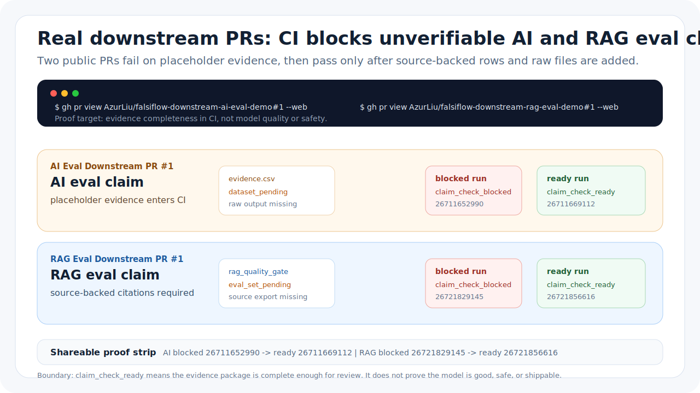

# Stop Shipping Unverifiable AI Eval Claims

"The model improved" is one of the easiest sentences to ship and one of the
hardest sentences to review.

It fits in a release note. It looks harmless in a PR description. It can even
be backed by a real benchmark number. But too often the claim arrives without
the things that make the number reviewable: the dataset version, prompt-set
hash, model revision, baseline revision, evaluator version, raw outputs,
sampling settings, item count, failure envelope, and the script that produced
the result.

That is not an AI problem. It is a release-engineering problem.

## The Failure Mode

Most teams already know a benchmark can lie by accident:

- The eval set changed after the baseline was recorded.
- The prompt set was edited without updating the headline.
- The model name points to "latest" instead of a pinned revision.
- The raw outputs live in someone's notebook, not in a reviewable artifact.
- The metric improved while hallucination, refusal, or safety failures got
  worse.
- A placeholder row made it into the CSV because the release was urgent.

None of those failures require bad intent. They happen because the sentence
"the model improved" is cheaper to copy than the evidence package behind it.

If CI can block a failing unit test, it should also be able to block a launch
claim whose evidence is missing, ambiguous, or still marked `dataset_pending`.

## What CI Should Ask

An AI eval or RAG eval claim should not pass because a Markdown paragraph sounds
confident. It should pass only after the repository answers concrete questions:

- Which dataset, task set, or retrieval corpus was used?
- Which prompt set, model revision, baseline revision, and evaluator version
  produced the result?
- Where are the raw model outputs or retrieval traces?
- What metric changed, and what safety or hallucination boundary stayed inside
  tolerance?
- How many items were evaluated?
- Can a reviewer inspect a source manifest and a portable evidence bundle?

The answer does not have to be complicated. A small CSV, a project config, raw
source files, and a GitHub Action can be enough. The important part is that the
claim has a machine-checkable contract.

## The Demo That Explains It

The fastest way to show the idea is a deliberately failing PR in a clean
downstream repository, not a screenshot of a tool UI.

The public version is
[AzurLiu/falsiflow-downstream-ai-eval-demo PR #1](https://github.com/AzurLiu/falsiflow-downstream-ai-eval-demo/pull/1).
Its first commit adds a confident AI eval claim with placeholder provenance.
The [blocked run](https://github.com/AzurLiu/falsiflow-downstream-ai-eval-demo/actions/runs/26711652990)
fails strict CI. The second commit adds source-backed rows and raw export
evidence. The
[ready run](https://github.com/AzurLiu/falsiflow-downstream-ai-eval-demo/actions/runs/26711669112)
passes.

First commit:

```csv
gate_id,candidate_id,sample_id,field,value,source_file,measured_at,operator_or_agent,instrument_id,notes
eval_provenance,candidate_model,eval_run_001,dataset_version_recorded,dataset_pending,source_files/ai_eval_raw_export.csv,2026-05-26T08:00:00Z,falsiflow_eval_operator,eval_harness_001,Placeholder dataset version should block readiness.
```

CI result:

```text
claim_check_blocked
blocking_stage: gate_evidence
```

Second commit:

```csv
gate_id,candidate_id,sample_id,field,value,source_file,measured_at,operator_or_agent,instrument_id,notes
benchmark_quality,candidate_model,eval_run_001,exact_match_rate,0.86,source_files/ai_eval_raw_export.csv,2026-05-26T09:00:00Z,falsiflow_eval_operator,eval_harness_001,Candidate exact-match metric.
```

The full evidence file also pins the prompt set, candidate model, baseline
model, evaluator version, hallucination rate, safety-policy failure rate, item
count, eval script hash, random seed or decode settings, raw outputs, human
spotcheck, and regression CI run.

CI result:

```text
claim_check_ready
verification_status: bundle_verified
```

That transition is the whole story: the same downstream PR goes from blocked to
ready only when the claim becomes reviewable.

The RAG version tells the same story with retrieval-specific evidence:
[AzurLiu/falsiflow-downstream-rag-eval-demo PR #1](https://github.com/AzurLiu/falsiflow-downstream-rag-eval-demo/pull/1)
first fails strict CI in
[run 26721829145](https://github.com/AzurLiu/falsiflow-downstream-rag-eval-demo/actions/runs/26721829145)
with `claim_check_blocked`; after the PR adds source-backed retrieval,
faithfulness, citation coverage, reproducibility rows, and the raw RAG eval
export, [run 26721856616](https://github.com/AzurLiu/falsiflow-downstream-rag-eval-demo/actions/runs/26721856616)
passes with `claim_check_ready`.

## What Falsiflow Adds

Falsiflow is a small CLI and GitHub Action for this specific boundary. It turns
a claim into evidence rows, source-file policy, derived metrics, acceptance
rules, Markdown reports, JSON for CI, source manifests, and portable evidence
bundles.

For AI eval and RAG eval claims, the bundled starter gate checks:

- eval provenance: dataset or task-set version, prompt-set hash, candidate
  model, baseline model, and evaluator version;
- benchmark quality: score, baseline comparison, item count, hallucination
  rate, and safety-policy failures;
- reproducibility package: script hash, seed or decode settings, raw outputs,
  human spotcheck, and regression CI evidence.

The local path is intentionally boring:

```bash
pipx install falsiflow
falsiflow quickstart --template ai_claim_evaluation --out ai_claim_review --strict
falsiflow doctor --project-dir ai_claim_review --strict
```

The GitHub Action path is the part that matters for teams:

```yaml
- uses: AzurLiu/falsiflow@v0.1.29
  with:
    mode: claim-check
    project-dir: falsiflow_ai_eval
    evidence: falsiflow_ai_eval/evidence.csv
    strict: "true"
```

The output is a ready/blocked decision that a release workflow can enforce and a
review package a human can inspect.

## The Boundary Matters

`claim_check_ready` does not mean the model is good. It does not mean the RAG
system is safe. It does not mean the benchmark is the right benchmark.

It means something narrower and more useful for CI:

```text
This repository supplied the evidence package required by its own claim gate.
```

That boundary keeps the tool honest. Expert review still matters. Dataset
design still matters. Safety and product judgment still matter. Falsiflow is
not trying to replace any of that. It is trying to stop unsupported claims from
quietly becoming release facts.

## Try The PR Story

Start with the downstream PR:

<https://github.com/AzurLiu/falsiflow-downstream-ai-eval-demo/pull/1>

The public demo PR playbook walks through the blocked commit, the evidence
repair commit, the GitHub Action, the uploaded reports, and the 30-second
recording script:

[docs/falsiflow_demo_pr_playbook.md](../falsiflow_demo_pr_playbook.md)

The shareable downstream proof strip is here:



Start with the failing PR. It explains the project faster than any feature
list.
